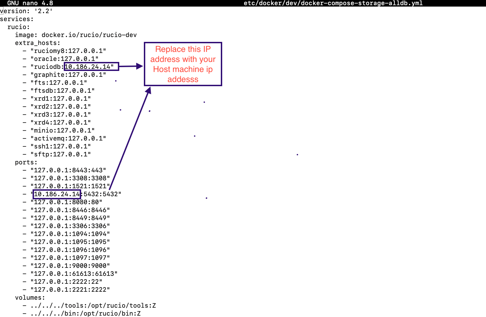
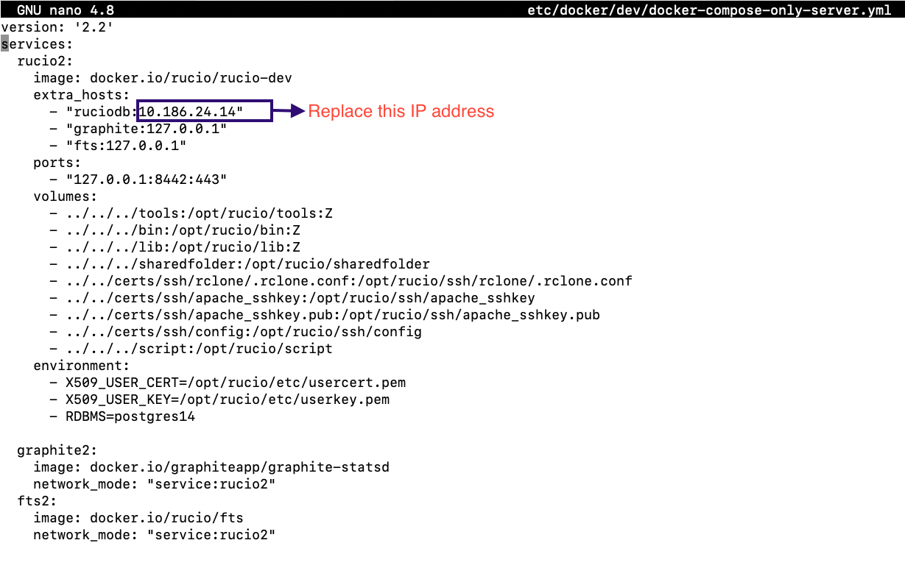
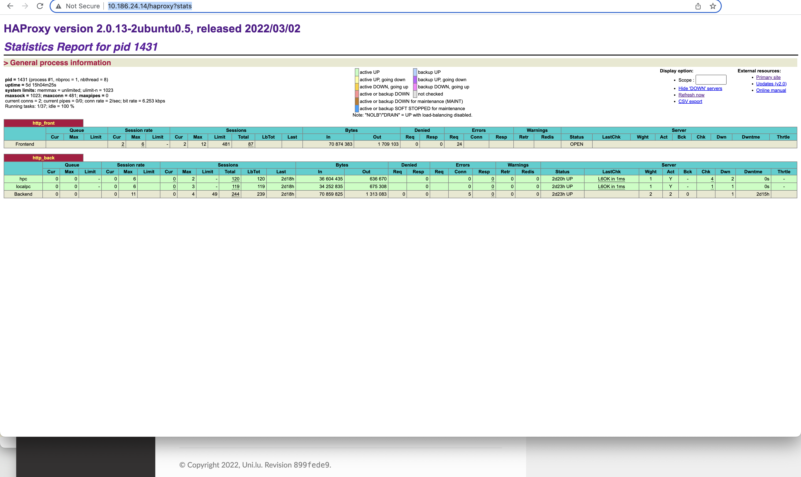

Distributed Rucio server configuration
======================================

Prerequisite:

1. Clone source code from the git repo.
	https://gitlab.uni.lu/omarcu/rucio.git
	
.. code-block:: console
	
	git clone https://gitlab.uni.lu/omarcu/rucio.git
	
Switch to branch xrood-protocol

2. Check docker version 

.. code-block:: console

   sudo docker --version 

If docker is not installed, install the docker and docker-compose:

.. code-block:: console

   sudo apt install docker.io
   sudo apt install docker-compose

Install multiple rucio server
-----------------------------

For distrbuted system we have install multilple rucio servers.

(**)Make sure you are in the project root directory (/rucio/)

3. We have to update IP for databse server in docker-compose file, so that multiple rucio can access the same databse.

.. code-block:: console

   vi etc/docker/dev/docker-compose-storage-alldb.yml

We have to use same IP address what we have used earlier.

.. code-block:: console

   vi etc/docker/dev/docker-compose-only-server.yml

4. Install 1st Ruico server by running docker-composer file. 

(**) Make sure you are in the project root directory (/rucio/)

(First time)
If docker is not pulled yet 

.. code-block:: console

   sudo docker-compose --file etc/docker/dev/docker-compose-storage-alldb.yml up -d
   
This docker-compose commad will install rucio server1, rucio client, postgress database, and storage server like XRootD. 

3. Install 2nd rucio server

(First time)
If docker is not pulled yet 

.. code-block:: console

   sudo docker-compose --file etc/docker/dev/docker-compose-only-server.yml up -d

This docker-compose commad will install only 2nd rucio server.

4. Enter into rucio dev server1

.. code-block:: console

   docker exec -it dev_rucio_1 /bin/bash

5. Check, the server is installed or not.

.. code-block:: console

   curl -k https://127.0.0.1/ping
   
If server is running then, you will get response with the version number of the rucio server.

.. code-block:: console

    {"version":"1.28.0"}
  
If you get 500 Internal Server Error , Then you have to install a missing python library pyhton-memcached
   
.. code-block:: console
  
  pip install python-memcached

Prepare and upload some demo data
---------------------------------

6. Run a script to initialize the database.

.. code-block:: console

   tools/run_tests_docker.sh -ir

7. Add a demo account by running a single script

.. code-block:: console

    sharedfolder/run_demo_data.sh

8. Logout form sever 1

.. code-block:: console

    exit

9. Enter into rucio dev server2

.. code-block:: console

   docker exec -it dev_rucio_1 /bin/bash

10. Check, the server is runnnig or not.

.. code-block:: console

   curl -k https://127.0.0.1/ping
   
If server is running then, you will get response with the version number of the rucio server.

.. code-block:: console

    {"version":"1.28.0"}
  
If you get 500 Internal Server Error , Then you have to install a missing python library pyhton-memcached
   
.. code-block:: console
  
  pip install python-memcached

HAProxy Install and Configuration
---------------------------------

11. If HAProxy is not installed we can instal it using the instruction of https://ulhpc-rucio-tutorials.readthedocs.io/en/latest/haproxyinstall.html
    
    [If HAProxy is already installed then we can ignore this step.]
    
12. Create a self-signed SSL certificate

.. code-block:: console

    sudo apt-get -y install openssl

12.a Run the following command to create your self-signed SSL certificate and move it to /etc/ssl/private

.. code-block:: console

   openssl req -nodes -x509 -newkey rsa:2048 -keyout /etc/ssl/private/test.key -out /etc/ssl/private/test.crt -days 30

12.b Now we have to create a pem file by copying key and certificate to a file. That goes with:

.. code-block:: console

   cat /etc/ssl/private/test.key /etc/ssl/private/test.crt > /etc/ssl/private/test.pem

13. Once installed HAProxy should already have a template for configuring the load balancer. Open the configuration file, for example,

.. code-block:: console

    sudo nano /etc/haproxy/haproxy.cfg

Add the following sections to the end of the file. Replace the with whatever you want to call your servers on the statistics page and with the private IPs for the servers you wish to direct the web traffic to.

.. code-block:: console

	frontend http_front
	   bind \*:80
	   bind \*:443 ssl crt /certs/haproxy.pem name sslweb
	   stats uri /haproxy?stats
	   default_backend http_back
	backend http_back
	   balance roundrobin
	   server server1 127.0.0.1:8442 check ssl verify none
	   server server2 127.0.0.1:8443 check ssl verify none

14. After making the configurations, save the file and restart HAProxy with the next command.

.. code-block:: console

    sudo systemctl restart haproxy

15. Testing the setup
 
With the HAProxy configured and running, open your load balancer server’s public IP in a web browser and check that you get connected to your backend correctly. The parameter stats uri in the configuration enables the statistics page at the defined address.

.. code-block:: console

    http://[IP_OF_THE_HAPROXY_HOST_SERVER]/haproxy?stats
    

16. Now we can check is rucio server can be access through HAProxy.

we can browse the following url

.. code-block:: console

  https://[IP_OF_THE_HAPROXY_HOST_SERVER]/ping
  
If server is running then, you will get response with the version number of the rucio server.

.. code-block:: console

    {"version":"1.28.0"}
    

With a single script
--------------------

There is a single script that will initialize and prepare all the server and data.

(**)Make sure you are in the project root directory (/rucio/)

Run the following script.

.. code-block:: console
	
	./initialize_distributed_server.sh
	

It will take some times to intall the servers.

