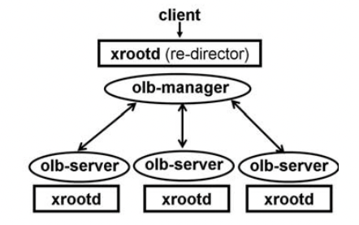
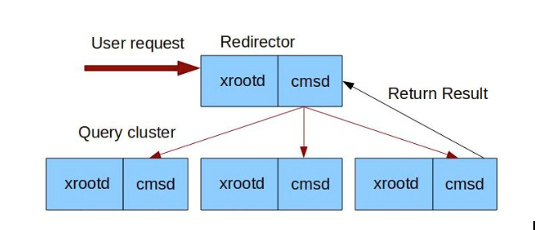

Distributed XRootD Configurataion
=================================

Distributed XRootD server
-------------------------

Olb: Open load balancers 
Basic Architecture:

A re-director node knows the XRootD protocol and accepts client calls for file access rather than serving data directly. It interacts with load balancers to find a suitable data server that can serve the client's request. 

A pure data server node known as the XRootD protocol can serve data stored on a certain file system. Each data server is potentially located on a different machine in the same local area network.

Load balancer(olb) may have the following roles:

* Manager
* Server

As a manager(olb-manager), the load balancer accepts file location requests from an XRootD redirector. Then the manager interacts with the olbs-server to check the current load and the availability of files.

On the other hand, an olb-server installed into the data server machine always pointed to an olb-manager and provide data location information to the manager. Once the actual data server is identified, the redirector redirects the client to that server. 

Note the difference between olb-server and data server. Whereas the olb-server only provides the location information, the xrootd data server really serves the actual data.

[Reference] https://osg-htc.org/docs/data/xrootd/install-storage-element/

Configuring an XRootD Server
----------------------------

   
CMSD: Cluster Management Services (Load balancer)

For multiple hosts we have to set up an XRootD cluster. Two daemons will run on each node:

Xrootd: The eXtended Root Daemon controls file access and storage.
Cmsd: The Cluster Management Services Daemon controls communication between nodes.

Redirector and manager load balancer setup
------------------------------------------

Enter into dev_xrd1_1  docker container 

.. code-block:: console

  sudo docker exec -it dev_xrd1_1 bin/bash

Modify /etc/xrootd/xrdrucio.cfg (redirector)

.. code-block:: console

  vi /etc/xrootd/xrdrucio.cfg

Remove all the old configurations and add the following configuration

.. code-block:: console

  all.export /rucio
  all.manager xrd1 1213
  all.role manager
  all.port 1094

Resart the docker container and again enter into dev_xrd1_1  docker container 

.. code-block:: console
  
  sudo docker exec -it dev_xrd1_1 bin/bash

And run the following command to start the CMSD load balancer

.. code-block:: console

  cmsd -R xrootd -p 1213 -c /etc/xrootd/xrdrucio.cfg

Data Server and server load balancer setup
------------------------------------------

We have created three data server nodes. dev_xrd2_1, dev_xrd3_1 and dev_xrd4_1

We have to follow the same steps for three of these servers. 
Enter into dev_xrd1_1  docker container

.. code-block:: console
  
  sudo docker exec -it dev_xrd2_1 bin/bash

Modify /etc/xrootd/xrdrucio.cfg (Data Server)

.. code-block:: console
  
  vi /etc/xrootd/xrdrucio.cfg

Remove all the old configurations and add the following configuration

.. code-block:: console
  
  all.export /rucio
  all.manager xrd1 1213
  all.role server
  all.port 1095 

[N.B. We have to use different port for different data node server.]

Resart the docker container and again enter into dev_xrd1_1  docker container 

.. code-block:: console
  
  sudo docker exec -it dev_xrd1_1 bin/bash

And run the following command to start the CMSD load balancer

.. code-block:: console
  
  cmsd -R xrootd -c /etc/xrootd/xrdrucio.cfg -A /tmp/rucio

For testing we can use the following command. 

.. code-block:: console

  xrdcp t2 root://xrd1:1094///rucio/

